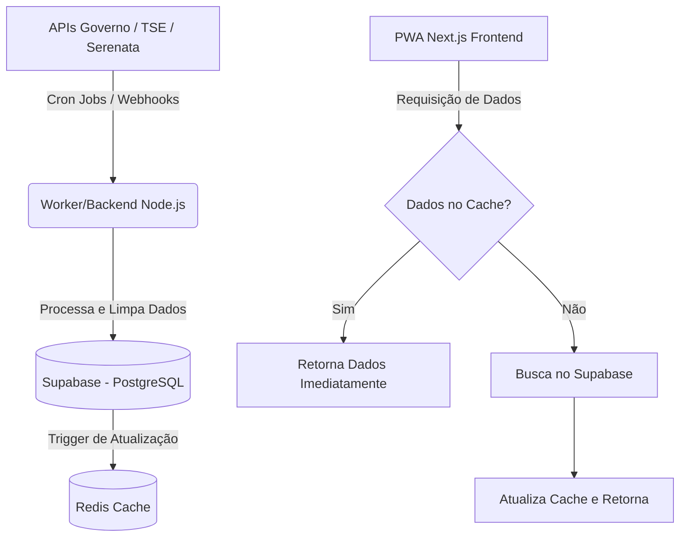

# Especificação Técnica - PWA Lupa Eleitoral 2026

**Visão Geral:** Aplicativo PWA focado em transparência eleitoral no Brasil para as eleições de 2026, permitindo aos eleitores fiscalizar Deputados, Senadores e candidatos através do cruzamento de dados de desempenho parlamentar e transparência financeira.

**Stack Tecnológico:**
*   **Frontend/BFF:** Next.js 15 (App Router), React, TypeScript
*   **Estilização:** Tailwind CSS, shadcn/ui (recomendado para componentes ágeis)
*   **Autenticação:** Clerk (Google e Apple)
*   **Banco de Dados/Backend (BaaS):** Supabase (PostgreSQL)
*   **Cache:** Redis (via Vercel KV ou Upstash) e Next.js Data Cache
*   **IA/LLM:** OpenAI API ou Google Gemini API

---

## 1. Consumo de APIs Públicas (Endpoint Strategy)

O aplicativo agregará dados de múltiplas fontes governamentais e independentes.

| Fonte de Dados | Propósito Principal | Endpoint Principal / Estratégia de Acesso |
| :--- | :--- | :--- |
| **Câmara dos Deputados (Dados Abertos)** | Perfil, despesas, proposições e presenças de deputados. | `GET /api/v2/deputados` (Lista) `GET /api/v2/deputados/{id}` (Detalhes) `GET /api/v2/deputados/{id}/despesas` `GET /api/v2/deputados/{id}/eventos` (Presença) |
| **Senado Federal (Dados Abertos)** | Perfil, despesas e matérias de senadores. | `GET /senadores/atual` (Lista) `GET /senador/{id}` (Detalhes) `GET /senador/{id}/cota` (Despesas) |
| **TSE (DivulgaCandContas / Repositório de Dados Eleitorais)** | Dados de candidaturas 2026, evolução patrimonial e doadores de campanha. | O TSE não possui uma API REST oficial estável de fácil consumo. Estratégia: Criar rotinas (Cron Jobs) em Python/Node.js para baixar os arquivos CSV/TXT dos Repositórios de Dados Eleitorais, processar e inserir no nosso banco Supabase. Para 2026, monitorar os endpoints não documentados do portal DivulgaCand quando o sistema entrar no ar. |
| **Operação Serenata de Amor (Jarbas)** | Identificação de gastos suspeitos da Cota para Exercício da Atividade Parlamentar (CEAP). | `GET https://jarbas.serenatadeamor.org/api/document/` (Buscar recibos com flags de suspeita gerados pela IA Rosie). Podemos cruzar o `applicant_id` com o ID do deputado. |

---

## 2. Arquitetura de Dados e Fluxo

### 2.1. Fluxo de Dados (Governo -> App -> Frontend)

Devido à instabilidade e lentidão das APIs governamentais, o frontend **nunca** deve chamá-las diretamente na requisição do usuário.

### 2.2. Estratégia de Caching (Stale-while-revalidate)

*   **Next.js Data Cache / ISR:** Utilizar o Incremental Static Regeneration (ISR) do Next.js 15 para as páginas de perfil dos políticos. Ex: `revalidate: 86400` (1 dia) para dados estáticos como biografia, e `revalidate: 3600` (1 hora) para despesas recentes.
*   **Redis (Vercel KV):** Para dados que precisam ser agregados dinamicamente (ex: média de gastos da casa no mês atual), armazenar o resultado pré-calculado no Redis.
*   **Stale-while-revalidate (SWR):** No lado do cliente, usar SWR ou React Query para exibir o dado em cache instantaneamente e buscar atualizações em background, garantindo que o app nunca pareça "congelado" aguardando a Câmara.

### 2.3. Esquema de Banco de Dados Simplificado (Supabase/PostgreSQL)

Visando armazenar o "perfil consolidado":

*   **Tabela `Politicos`**
    *   `id` (UUID, PK)
    *   `id_camara_senado` (Int, Nullable)
    *   `cpf` (String, Unique)
    *   `nome_urna` (String)
    *   `cargo_atual` (Enum: Deputado, Senador, Nenhum)
    *   `partido_atual` (String)
    *   `uf` (String)
    *   `foto_url` (String)
    *   `tags_ia` (Array de Strings) - Ex: ["Pró-Educação", "Agro"]
*   **Tabela `Evolucao_Patrimonial`**
    *   `id` (UUID, PK)
    *   `politico_id` (FK -> Politicos)
    *   `ano_eleicao` (Int)
    *   `valor_declarado` (Decimal)
*   **Tabela `Despesas_Mensais_Consolidadas`**
    *   `id` (UUID, PK)
    *   `politico_id` (FK -> Politicos)
    *   `ano` (Int)
    *   `mes` (Int)
    *   `valor_total` (Decimal)
    *   `flags_suspeita_qtd` (Int) - Dados vindos do Jarbas/Serenata
*   **Tabela `Desempenho_Plenario`**
    *   `id` (UUID, PK)
    *   `politico_id` (FK -> Politicos)
    *   `legislatura` (Int)
    *   `presencas` (Int)
    *   `ausencias_justificadas` (Int)
    *   `ausencias_nao_justificadas` (Int)

---

## 3. Features de Transparência (MVP)

### 3.1. Ranking de Assiduidade
*   **Lógica:** O cálculo deve penalizar apenas as faltas não justificadas.
*   **Fórmula:** `Score = (Presenças + Ausências Justificadas) / Total de Sessões`
*   **Visualização:** Um gráfico de rosca (donut chart) verde/vermelho, destacando o percentual de comparecimento efetivo, com um tooltip detalhando as justificativas médicas/oficiais.

### 3.2. Termômetro de Gastos
*   **Lógica:** Calcular a média mensal de gastos da Cota (CEAP) de todos os parlamentares do mesmo estado (já que as cotas variam por UF).
*   **Visualização:** Um componente de barra de progresso horizontal (Termômetro). O ponteiro marca o gasto do político selecionado, enquanto zonas de cor (Verde, Amarelo, Vermelho) indicam se ele está abaixo da média estadual, na média ou acima do percentil 90 (gastador extremo). Integração de um ícone de alerta caso haja `flags_suspeita_qtd > 0` (via Serenata de Amor).

### 3.3. Evolução Patrimonial
*   **Lógica:** Agrupar os totais de bens declarados ao TSE por ano eleitoral. Ajustar os valores pela inflação (IPCA) para o ano atual para uma comparação justa.
*   **Visualização:** Um gráfico de linha simples (Line Chart) mostrando o crescimento. Um marcador percentual mostrando a variação `(Valor Atual - Valor Inicial) / Valor Inicial * 100`.

---

## 4. Integração com LLM (Vibe Coding)

**Objetivo:** Traduzir o "juridiquês" das ementas dos Projetos de Lei (PLs) para perfis temáticos fáceis de entender.

**Pipeline de Dados (Agente IA):**
1.  **Ingestão:** Diariamente, um script busca novos PLs de autoria do político nas APIs do governo.
2.  **Prompting:** A ementa e o inteiro teor (resumo) são enviados para a API de um LLM (ex: GPT-4o-mini ou Claude 3 Haiku para custo-benefício) com o seguinte System Prompt:
    > "Você é um analista político neutro. Leia a seguinte ementa de projeto de lei. Categorize este projeto em no máximo 3 das seguintes tags pré-definidas: [Saúde, Educação, Segurança, Economia, Meio Ambiente, Pautas Morais, Infraestrutura, Agropecuária]. Retorne APENAS um array JSON com as tags. Caso seja uma homenagem ou dar nome a rua, use a tag [Irrelevante]."
3.  **Agregação:** No banco de dados (`Politicos.tags_ia`), agregamos as tags mais frequentes dos últimos 4 anos. Se 60% dos projetos são de "Educação", a tag "Focado em Educação" ganha destaque no perfil do político.

---

## 5. Autenticação (Clerk)

A autenticação servirá para o eleitor salvar seus "Políticos Favoritos", criar alertas (ex: "Avise-me se este deputado gastar fora do normal") e participar de fóruns locais futuramente.

*   **Provedor:** Clerk (fácil integração com Next.js 15 Middleware).
*   **Métodos Habilitados:** Apenas Social Logins (Google e Apple) para evitar atrito de criação de senhas e aumentar a conversão de usuários.
*   **Fluxo:** O usuário pode navegar anonimamente. Ao clicar em "Acompanhar Político", o modal do Clerk é acionado.

---

## 6. Telas e Protótipo Simples

### 6.1. Tela Inicial (Dashboard / Busca)
*   **Header:** Logo "Lupa Eleitoral", Barra de Busca global (Nome, CPF ou Estado), Botão de Login (Clerk).
*   **Hero Section:** "Descubra como seu representante atua e gasta."
*   **Destaques:** Cards pequenos roláveis horizontalmente com: "Os mais assíduos", "Maiores gastos do mês".
*   **Protótipo Visual:** Minimalista, fundo claro (ou dark mode nativo), tipografia grande e legível.

### 6.2. Tela de Perfil do Político (Visão Consolidada)
Esta é a tela principal do PWA.

*   **Cabeçalho:** Foto redonda, Nome de Urna, Partido-UF, e as Tags geradas por IA (ex: 🏷️ *Pró-Educação*, 🏷️ *Segurança*). Botão "Acompanhar" (Coração).
*   **Card 1: Termômetro de Gastos (Mês/Ano Atual):** O gráfico visual (Verde/Vermelho) comparando com a média da câmara. Se houver alerta do Jarbas, um banner vermelho discreto: "Contém 2 despesas sob investigação da Serenata de Amor".
*   **Card 2: Assiduidade (Legislatura Atual):** Gráfico de donut mostrando % de presença nas sessões.
*   **Card 3: Evolução Patrimonial:** Gráfico de linha mostrando o patrimônio de 2018 vs 2022 vs 2026.
*   **Card 4: Últimos Projetos de Lei:** Lista dos 3 PLs mais recentes com um resumo gerado por IA de 2 linhas para humanos entenderem, sem jargões.

### 6.3. Tela "Meu Eleitorado" (Área Logada)
*   Exige login via Google/Apple.
*   Mostra um feed de atualizações apenas dos políticos que o usuário marcou para acompanhar. Ex: "O Deputado X protocolou um novo projeto de lei hoje", "Os gastos do Senador Y do último mês foram publicados".